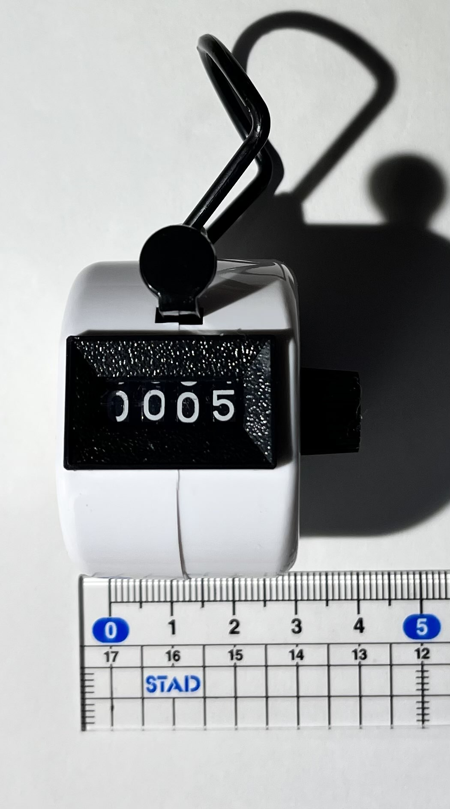

# 構想設計

## ■HandyEnigmaエンジンの設計方針
- ３Dプリンタで２６文字の換字暗号器を作る
- シンプルで手が掛からない設計にする（手配線/ビス止めなど極力削減）
- 動作するものを小さく製作して徐々に改善する
- 機能を追加しやすいモジュラーな構成にする
- 製作初期から展示会でデモ展示する
- 部活中心に興味を持つメンバーを巻き込む
- チャレンジングな点：複数拠点の共同作業での機構試作（オンライン活用）

## ■エンジンの目標フットプリント
- 直径が40-60mm/高さ30mm程度の円筒状。
- 横が開いていて厚さ6mm程度のロータ３枚を入替え出来る。入れてかちっと止める。
- ロータを指で回転して暗号鍵アルファベットを設定する。
- 数取器の様なプッシュレバー機構が付いていて１文字(1/26回転)ずつ進めることができる。
- 端にフレキ端子(26回路)とGlobe端子を付ける。端子に任意にLED/キー/マイコン接続できる。

## ■回転機構（ロータ）
- ３枚のロータ／１枚のリフレクタ／１枚のインタフェースで構成する。
- 各ロータはプッシュレバーをワンプッシュするとラチェット方向に1/26回転する。
- 正確に1/26位置にストップする爪機構を設ける。
- ロータにはキャリーノッチを設け、３桁順次桁上がりする。
- 桁上がり機構は各方式有りそう。（ロータ円周内側はスクランブラのために空けておく。）
- 軸は精度の良い金属が安全そう。（ロータから樹脂軸が突出して隣と勘合する案は別途検討。）
- ロータ相互入替え可能にしたいので、単一ロータ設計をよく考えよう。
- ロータ円周外側にアルファベット表示が必要。（幅3mm程度？）

## ■電気回路（スクランブラ）
- ３枚のロータが各１枚のスクランブラを内蔵する。
- スクランブラは１枚の両面PCB基盤からなる。
- PCB内のスルホールとVIAでスクランブル回路を構成する。（回路パターンは３～５種類）
- スクランブラは円周上に26接触キーを持ち隣のスクランブラ上の26接触パッドと接触する。
- 隣との接触はPCB表コンタクトキーとPCB裏コンタクトパッドが軽く圧接することで行う。
- コンタクトキーはPogoPinかSpringFingerをPCB上に表面実装する。（高さ5mm前後目標）
- コンタクトパッドはPCB裏の銅箔パターン（円ないし扇型）とする。
- リフレクタは２層PCB１枚で構成し26信号をシャッフルして入れ替えて折り返す。
- インタフェースから26本の線を外部コネクタへ取り出す。
- PCB技術を利用し出来るだけ薄く小径コンパクトに作成する。

## ■設計アイデア
- ローター  
	３Ｄプリント技術で出来る限り薄くコンパクトにしていく  
	オリジナルの機構完成度が高いのでそれに忠実にも作れそう。（よりシンプルにできるかも。）  
	各ローターは入替のため同じ構造である必要がある（ラチェット／キャリーノッチ含む）	
- スクランブラ  
	PCB技術を利用して出来るだけコンパクトに作成する
	スルホールとVIAでスクランブラ回路を形成する（配線不要）  
	接点はPCB表のコンタクトキーとPCB裏のコンタクトパッドからなる  
	コンタクトキーはPogoPinかSpringFingerをPCB表面実装する。（高さ5mm前後）  
	標準的な1.6mm厚のPCB基盤上に実装して概ね厚さ6mm以内にできそう。  
- インタフェース  
	PINヘッダ用スルホールパターンを設け各線直結可能にする。(試作時は"A-F"の6Key接続)  
	FPCコネクタで26線全部をコンパクトに取り出す。（キーSWやLEDのPCBと直結できる。）  
	PCB上にI2C-GPIOエキスパンダを32ch実装しGlobeコネクタを取り出す。（M5.Stackに直結できる）  
	余裕が有ればボタン電池・LEDと抵抗・タクトスイッチも表面実装する。    
- リフレクタ  
	ほぼPCB１枚＋軸端保持機構だけでいけそう。（軸方向に圧をかけるばねは要りそう）

## ■エンジンの活用イメージ
- FCPフレキの先はLED/キースイッチ/プラグボード基盤につなぐことが出来る。
- プッシュレバー機構をキーボードからのリンクに接続するとキーボードに連動出来る。
- Globeの先はRasPi/M5StackなどのI/Oに繋げる。（CardKey/LCD/ATOMプリンタ等と接続可能。）
- レバーと別にモータ駆動するためのギアを付けたい。１回転が１プッシュ相当。M5.Stcakで制御。
- 試作の"A-F"の6Key程度のミニ版、派生のスペース/数字/小文字の有る39文字版も一案。
- 本日の暗号キーを掲示共有して、展示会場やTwitterで参加者と遊びたい。（複数台ある前提）

## ■機構の参考

[エニグマ暗号機の仕組みとは？](https://www.youtube.com/watch?v=ybkkiGtJmkM&t=955s "https://www.youtube.com/watch?v=ybkkiGtJmkM&t=955s")

<table>
  <tr>
    <td></td>
    <td></td>
    <td></td>
</tr>
</table>

