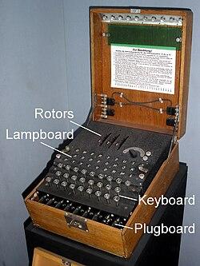
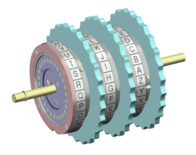

# Handy Enigma Project
## 🌟 目的

3Dプリントで **「Enigma」（エニグマ）** を再現するプロジェクトです。
歴史的な暗号機 Enigmaを3Dプリントを使って楽しく再現します！  

## 🎯 趣旨

- メカ工作初心者がチームを組んで、3Dプリンタを用いた工作に取り組みます。
- シンプルでコンパクトな構造で暗号機能を再現し、展示会で成果を発表します。
- MakerFaireなどのイベントを目指し、製作過程も楽しみながら共有します。

## 🚀 方針

- Enigma心臓部のスクランブラ回路を現代技術でハンディに実現します。
- 小さな機能から始めてステップを踏み徐々に機能を拡張しながら動作を実証します。
- 開発経過や試行錯誤など含むプロジェクト状況を随時展示やレポートとして発表します。
- 実動試作機は材料費1万円以内を想定しています。

## ⚙️ Enigmaってなに？

Enigma（エニグマ）は第二次世界大戦中にドイツで使われた、ローターと呼ばれる歯車を使った暗号機です。  アルファベットの入力に応じてローターが回転し、複雑に配線された回路で文字を置き換える仕組みで、解読が非常に困難でした。このプロジェクトでは、そのメカニカルな仕組みを再現し、実際に動くモデルを作ります。  

## 📅 開発ステップ（予定）

1. ローター機構とスクランブラー回路を試作し機械的な動作と電気接触を確認する。
2. 簡単なキースイッチ入力とLEDによる出力表示を追加する。
3. 実動ミニモデルを完成させて、MakerFaire等で展示する。(”A-F”6文字くらいが最初の目標)
4. フィードバックをもとに、改善／機能拡張などの追加要素を検討。
5. 設計データを公開して広く共有。（直径40-60mm/高さ30mm円筒を想定）  

## 🙌 仲間を募集中！

- メカ工作や3Dプリント初心者歓迎です。楽しみながらスキルアップしましょう。
- 技術部活動のDiscordやGitHubで進捗共有や意見交換を行います。
- 部活動関連のMakerSpaceの3Dプリンタ活用や、DMM.make等の配送サービス活用も検討しますが、3Dプリント経験者やご自身で3Dプリンタで試作できる方大歓迎です。
- メカと回路設計はオープンソース化を想定します。Make:で繋がりましょう。

みんなでワイワイ楽しみながら、実際に動くEnigmaを作って、展示イベントに一緒に出展しましょう！
